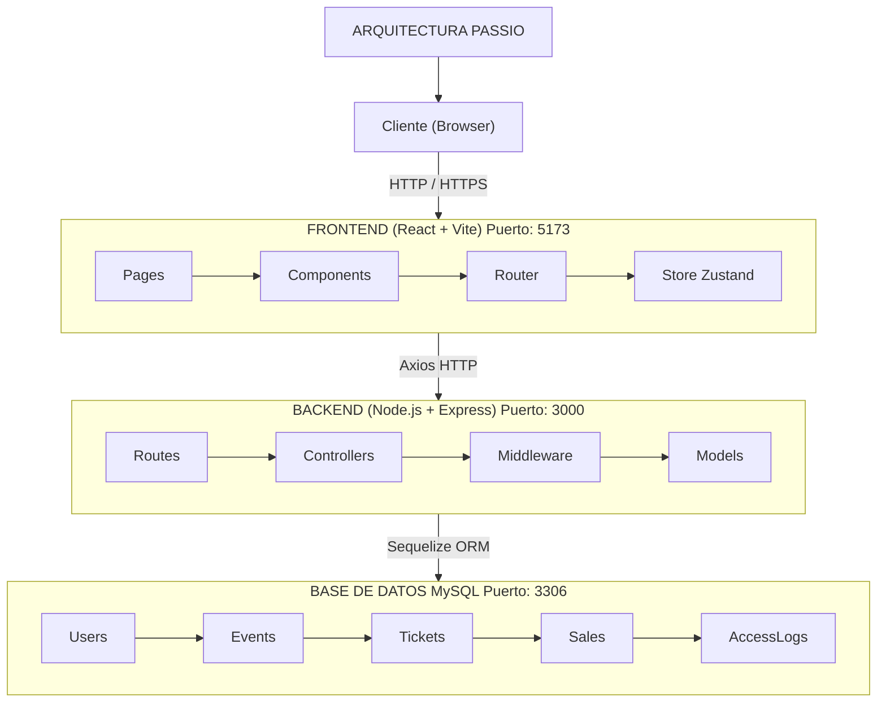
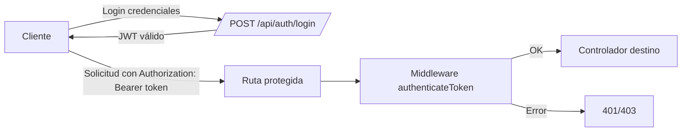

# 🎫 Manual Técnico - PASSIO

## Plataforma de Gestión de Eventos

---

## Tabla de contenidos

1. [Descripción General del Sistema](#1-descripción-general-del-sistema)
2. [Arquitectura del Sistema](#2-arquitectura-del-sistema)
3. [Requisitos del Sistema](#3-requisitos-del-sistema)
4. [Configuración del Backend](#4-configuración-del-backend)
5. [Configuración del Frontend](#5-configuración-del-frontend)
6. [Dependencias](#6-dependencias)
7. [Guía de Despliegue](#7-guía-de-despliegue)
8. [Estructura de Directorios](#8-estructura-de-directorios)
9. [Módulos](#9-módulos)
10. [API Endpoints](#10-api-endpoints)
11. [Variables de Entorno](#11-variables-de-entorno)
12. [Seguridad y Autenticación](#12-seguridad-y-autenticación)

---

## 1. Descripción General del Sistema

**PASSIO** es una plataforma web de gestión de eventos que permite la administración de eventos, venta de tickets, control de acceso y generación de reportes. El sistema está desarrollado con una arquitectura cliente-servidor separada:

| Componente        | Tecnología        | Repositorio                              |
| ----------------- | ----------------- | ---------------------------------------- |
| **Frontend**      | React + Vite      | https://github.com/Veggagf/Passio_front  |
| **Backend**       | Node.js + Express | https://github.com/Veggagf/Passio_back   |
| **Base de Datos** | MySQL             | -                                        |

---

## 2. Arquitectura del Sistema



---

## 3. Requisitos del Sistema

### Software Requerido

| Software | Versión Mínima | Recomendada |
| -------- | -------------- | ----------- |
| Node.js  | 18.x           | 20.x LTS    |
| npm      | 9.x            | 10.x        |
| MySQL    | 8.0            | 8.0+        |
| Git      | 2.x            | Última      |

### Hardware Recomendado (Desarrollo)

- **RAM:** 4GB mínimo, 8GB recomendado
- **Almacenamiento:** 500MB para el proyecto
- **Procesador:** Dual-core o superior

### Hardware Recomendado (Producción)

- **RAM:** 2GB mínimo por contenedor/servicio
- **Almacenamiento:** SSD con mínimo 20GB
- **Procesador:** 2 vCPUs o superior

---

## 4. Configuración del Backend

### 4.1 Instalación

```bash
git clone https://github.com/Veggagf/Passio_back.git
cd Passio_back
npm install
```

### 4.2 Configuración de Variables de Entorno

Crear archivo `.env` en la raíz:

```env
PORT=3000
NODE_ENV=development
DB_HOST=localhost
DB_PORT=3306
DB_NAME=passio_db
DB_USER=root
DB_PASSWORD=tu_contraseña_segura
JWT_SECRET=tu_clave_secreta_cambiar_en_produccion
JWT_EXPIRES_IN=7d
FRONTEND_URL=http://localhost:5173
```

### 4.3 Configuración de Base de Datos

```sql
CREATE DATABASE passio_db CHARACTER SET utf8mb4 COLLATE utf8mb4_unicode_ci;
CREATE USER 'passio_user'@'localhost' IDENTIFIED BY 'password_seguro';
GRANT ALL PRIVILEGES ON passio_db.* TO 'passio_user'@'localhost';
FLUSH PRIVILEGES;
```

### 4.4 Scripts Disponibles

| Comando                | Descripción                           |
| ---------------------- | ------------------------------------- |
| `npm start`            | Inicia el servidor en modo producción |
| `node server.js`       | Inicia el servidor directamente       |
| `node create-admin.js` | Crea usuario administrador inicial    |
| `node test-db.js`      | Verifica conexión a la base de datos  |

---

## 5. Configuración del Frontend

### 5.1 Instalación

```bash
git clone https://github.com/Veggagf/Passio_front.git
cd Passio_front
npm install
```

### 5.2 Scripts Disponibles

| Comando           | Descripción                             |
| ----------------- | --------------------------------------- |
| `npm run dev`     | Inicia el servidor de desarrollo (Vite) |
| `npm run build`   | Genera la build de producción           |
| `npm run preview` | Previsualiza la build de producción     |
| `npm run lint`    | Ejecuta ESLint para análisis de código  |

---

## 6. Dependencias

### 6.1 Backend (passio_nodejs)

**Dependencias de Producción:**

| Paquete      | Descripción                              |
| ------------ | ---------------------------------------- |
| express      | Framework web para Node.js               |
| mysql2       | Driver MySQL para Node.js                |
| sequelize    | ORM para bases de datos SQL              |
| jsonwebtoken | Implementación de JWT para autenticación |
| bcryptjs     | Hash de contraseñas                      |
| cors         | Middleware para habilitar CORS           |
| helmet       | Middleware de seguridad HTTP             |
| morgan       | Logger de peticiones HTTP                |
| dotenv       | Carga de variables de entorno            |
| multer       | Middleware para manejo de archivos       |

### 6.2 Frontend (Passio_front)

**Dependencias de Producción:**

| Paquete          | Versión  | Descripción                    |
| ---------------- | -------- | ------------------------------ |
| react            | ^19.2.0  | Biblioteca principal de UI     |
| react-dom        | ^19.2.0  | Renderizado de React en el DOM |
| react-router-dom | ^7.9.6   | Enrutamiento para React        |
| react-hook-form  | ^7.66.1  | Manejo de formularios          |
| axios            | ^1.13.2  | Cliente HTTP                   |
| zustand          | ^5.0.8   | Gestión de estado global       |
| lucide-react     | ^0.554.0 | Iconos SVG para React          |

**Dependencias de Desarrollo:**

| Paquete              | Versión  | Descripción                         |
| -------------------- | -------- | ----------------------------------- |
| vite                 | ^7.2.2   | Build tool y servidor de desarrollo |
| @vitejs/plugin-react | ^5.1.0   | Plugin de React para Vite           |
| tailwindcss          | ^4.1.17  | Framework CSS utilitario            |
| daisyui              | ^5.5.5   | Componentes UI para Tailwind        |
| postcss              | ^8.5.6   | Procesador CSS                      |
| autoprefixer         | ^10.4.22 | Plugin PostCSS para prefijos        |
| eslint               | ^9.39.1  | Linter de JavaScript                |

---

## 7. Guía de Despliegue

**Backend:**

```bash
cd passio_nodejs
npm install
node server.js
# El servidor estará disponible en http://localhost:3000
```

**Frontend:**

```bash
cd Passio_front
npm install
npm run dev
# La aplicación estará disponible en http://localhost:5173
```

## 8. Estructura de Directorios

### 8.1 Backend (Passio_back)

```
passio_nodejs/
├── server.js              # Punto de entrada principal
├── package.json           # Dependencias y scripts
├── package-lock.json
├── .env                   # Variables de entorno
|
├── src/
│   ├── app.js            # Configuración de Express
│   ├── config/
│   │   ├── database.js   # Configuración de Sequelize/MySQL
│   │   └── env.js        # Carga de variables de entorno
│   ├── controllers/      # Lógica de negocio
│   │   ├── authController.js
│   │   ├── dashboardController.js
│   │   ├── eventController.js
│   │   ├── ticketController.js
│   │   └── userController.js
│   ├── middleware/
│   │   ├── auth.js
│   │   ├── errorHandler.js
│   │   └── upload.js
│   ├── models/
│   │   ├── AccessLog.js
│   │   ├── Event.js
│   │   ├── Sale.js
│   │   ├── Ticket.js
│   │   ├── User.js
│   │   └── index.js
│   ├── routes/
│   │   ├── auth.js
│   │   ├── dashboard.js
│   │   ├── events.js
│   │   ├── tickets.js
│   │   └── user.js
│   └── utils/
│       └── validators.js
├── docs/
|   ├── MANUAL_TECNICO.md
|   ├── MANUAL DE USUARIO.md
|   ├── README-BACKEND.md
|   ├── README-FRONTEND.md
|   └── README.md
|
└── node_modules/
```

### 8.2 Frontend (Passio_front)

```
Passio_front/
├── .gitignore
├── eslint.config.js
├── index.html
├── package-lock.json
├── package.json
├── postcss.config.js
├── tailwind.config.js
├── vite.config.js
|
├── src/
│   ├── App.css
│   ├── App.jsx
│   ├── index.css
│   ├── main.jsx
│   ├── api/
│   ├── assets/
│   ├── components/
│   ├── pages/
│   ├── router/
│   ├── store/
│   └── utils/
|
├── docs/
|   ├── MANUAL_TECNICO.md
|   ├── MANUAL DE USUARIO.md
|   ├── README-BACKEND.md
|   ├── README-FRONTEND.md
|   └── README.md
|
└── node_modules/
```

---

## 9. Módulos

### 9.1 Módulos del Frontend

#### 9.1.1 Enrutamiento y Páginas

- Usa `react-router-dom` para definir rutas públicas y protegidas.
- `AppRouter` configura rutas como inicio, login, registro y listados de eventos.
- `ProtectedRoute` restringe el acceso según el rol autenticado.

#### 9.1.2 Estado de Autenticación

- `useAuthStore` con Zustand almacena usuario, rol y token.
- Persiste información en `localStorage` para mantener sesión activa.
- Expone acciones de `login` y `logout` para toda la aplicación.

#### 9.1.3 Comunicación con la API

- `axios.js` crea una instancia con `baseURL` del back-end.
- Interceptor de petición agrega el `Bearer token` salvo en login y registro.
- Interceptor de respuesta limpia el token si el servidor responde 401.

#### 9.1.4 Componentes Clave de UI

- Formularios de autenticación: `LoginForm` y `RegisterForm`.
- Tablas genéricas: `Table` para listar usuarios, asistentes y boletos.
- Modales: `Modal`, `EventModal`, `UserModal` para CRUD visual.

#### 9.2 Módulos del Backend

#### 9.2.1 Servidor y Configuración

- `app.js` configura Express, CORS, Helmet y rutas base de la API.
- Expone rutas `/api/auth`, `/api/users`, `/api/events`, `/api/tickets`, `/api/dashboard`.
- Sirve archivos estáticos de imágenes desde `/uploads`.

#### 9.2.2 Middleware

- `auth.js` autentica JWT y autoriza roles específicos.
- `errorHandler.js` centraliza el manejo de errores y códigos HTTP.
- `upload.js` usa Multer para guardar imágenes en disco.

#### 9.2.3 Controladores

- `authController` maneja login, registro, logout y `/me`.
- `userController` gestiona CRUD de usuarios con reglas por rol.
- `eventController` gestiona CRUD de eventos y subida de imágenes.
- `ticketController` gestiona compra, validación y consulta de boletos.
- `dashboardController` genera estadísticas por evento y por organizador.

#### 9.2.4 Rutas

- `auth.js` define endpoints de autenticación bajo `/api/auth`.
- `users.js` expone endpoints de usuarios bajo `/api/users`.
- `events.js` define endpoints de eventos bajo `/api/events`.
- `tickets.js` agrupa acciones de compra y validación bajo `/api/tickets`.
- `dashboard.js` provee métricas bajo `/api/dashboard`.

---

## 10. API Endpoints

**Este apartado documenta todos los endpoints disponibles en la API (ruta base por defecto: http://localhost:3000).
La mayoría de endpoints requieren un JWT en el header: `Authorization: Bearer <JWT_TOKEN>`**

### 10.1 Rutas públicas / utilidades

- 10.1.1 GET /

  - Descripción: Información básica de la API.
  - Ejemplo (bash):
    ```bash
    curl -sS http://localhost:3000/
    ```
  - Respuesta (JSON):
    ```json
    {
      "success": true,
      "message": "API de Passio - Plataforma de Gestión de Eventos",
      "version": "1.0.0"
    }
    ```

- 10.1.2 GET /health

  - Descripción: Health check del servidor.
  - Ejemplo (bash):
    ```bash
    curl -sS http://localhost:3000/health
    ```
  - Respuesta (JSON):
    ```json
    {
      "success": true,
      "message": "Server is running",
      "timestamp": "2025-11-30T12:00:00.000Z"
    }
    ```

- 10.1.3 GET /uploads/\*
  - Descripción: Sirve archivos estáticos subidos (ej. imágenes de eventos).
  - Ejemplo: Abrir en el navegador o:
    ```bash
    curl -I http://localhost:3000/uploads/imagen.jpg
    ```

### 10.2 /api/auth (autenticación)

- 10.2.1 POST /api/auth/register

  - Descripción: Registrar nuevo usuario.
  - Auth: NO (público)
  - Body (JSON):
    ```json
    {
      "name": "María Pérez",
      "username": "maria123",
      "email": "maria@example.com",
      "password": "secreto123",
      "role": "usuario"
    }
    ```
  - Ejemplo (bash):
    ```bash
    curl -sS -X POST http://localhost:3000/api/auth/register \
      -H "Content-Type: application/json" \
      -d '{"name":"María Pérez","username":"maria123","email":"maria@example.com","password":"secreto123"}'
    ```
  - Respuesta (JSON, 201):
    ```json
    {
      "success": true,
      "message": "Usuario registrado exitosamente",
      "data": {
        "token": "<JWT_TOKEN>",
        "user": {
          "id": 12,
          "name": "María Pérez",
          "username": "maria123",
          "email": "maria@example.com",
          "role": "usuario"
        },
        "role": "usuario"
      }
    }
    ```

- 10.2.2 POST /api/auth/login

  - Descripción: Login por username o email.
  - Auth: NO (público)
  - Body (JSON):
    ```json
    {
      "identifier": "maria123",
      "password": "secreto123"
    }
    ```
  - Ejemplo (bash):
    ```bash
    curl -sS -X POST http://localhost:3000/api/auth/login \
      -H "Content-Type: application/json" \
      -d '{"identifier":"maria123","password":"secreto123"}'
    ```
  - Respuesta (JSON, 200):
    ```json
    {
      "success": true,
      "message": "Login exitoso",
      "data": {
        "token": "<JWT_TOKEN>",
        "user": {
          "id": 12,
          "name": "María Pérez",
          "username": "maria123",
          "email": "maria@example.com",
          "role": "usuario"
        },
        "role": "usuario"
      }
    }
    ```

- 10.2.3 POST /api/auth/logout

  - Descripción: Logout (respuesta simple).
  - Auth: SÍ
  - Ejemplo (bash):
    ```bash
    curl -sS -X POST http://localhost:3000/api/auth/logout \
      -H "Authorization: Bearer <JWT_TOKEN>"
    ```
  - Respuesta (JSON, 200):
    ```json
    {
      "success": true,
      "message": "Logout exitoso"
    }
    ```

- 10.2.4 GET /api/auth/me
  - Descripción: Datos del usuario autenticado.
  - Auth: SÍ
  - Ejemplo (bash):
    ```bash
    curl -sS http://localhost:3000/api/auth/me \
      -H "Authorization: Bearer <JWT_TOKEN>"
    ```
  - Respuesta (JSON, 200):
    ```json
    {
      "success": true,
      "data": {
        "id": 12,
        "name": "María Pérez",
        "username": "maria123",
        "email": "maria@example.com",
        "role": "usuario"
      }
    }
    ```

### 10.3 /api/users (restringido; todas requieren token)

- Nota: router aplica authenticateToken globalmente; algunas operaciones requieren rol `administrador`.

- 10.3.1 GET /api/users/

  - Descripción: Listar todos los usuarios.
  - Auth: SÍ (rol administrador)
  - Ejemplo (bash):
    ```bash
    curl -sS http://localhost:3000/api/users \
      -H "Authorization: Bearer <JWT_TOKEN>"
    ```
  - Respuesta (JSON, 200): array de usuarios (sin password)
    ```json
    [
      {
        "id": 1,
        "name": "Admin",
        "username": "admin_debug",
        "email": "admin@example.com",
        "role": "administrador",
        "created_at": "2025-01-01T12:00:00.000Z"
      }
    ]
    ```

- 10.3.2 GET /api/users/:id

  - Descripción: Obtener usuario por id (admin o el mismo usuario).
  - Auth: SÍ
  - Ejemplo (bash):
    ```bash
    curl -sS http://localhost:3000/api/users/12 \
      -H "Authorization: Bearer <JWT_TOKEN>"
    ```
  - Respuesta (JSON, 200):
    ```json
    {
      "id": 12,
      "name": "María Pérez",
      "username": "maria123",
      "email": "maria@example.com",
      "role": "usuario"
    }
    ```

- 10.3.3 POST /api/users/

  - Descripción: Crear usuario (requiere token).
  - Auth: SÍ
  - Body (JSON): igual que /api/auth/register
  - Ejemplo (bash):
    ```bash
    curl -sS -X POST http://localhost:3000/api/users \
      -H "Content-Type: application/json" \
      -H "Authorization: Bearer <JWT_TOKEN>" \
      -d '{"name":"Pedro","username":"pedro1","email":"pedro@example.com","password":"pass123"}'
    ```
  - Respuesta (JSON, 201):
    ```json
    {
      "id": 13,
      "name": "Pedro",
      "username": "pedro1",
      "email": "pedro@example.com",
      "role": "usuario"
    }
    ```

- 10.3.4 PUT /api/users/:id

  - Descripción: Actualizar usuario.
  - Auth: SÍ
  - Ejemplo (bash):
    ```bash
    curl -sS -X PUT http://localhost:3000/api/users/13 \
      -H "Content-Type: application/json" \
      -H "Authorization: Bearer <JWT_TOKEN>" \
      -d '{"name":"Pedro Actualizado"}'
    ```
  - Respuesta (JSON, 200):
    ```json
    {
      "id": 13,
      "name": "Pedro Actualizado",
      "username": "pedro1",
      "email": "pedro@example.com"
    }
    ```

- 10.3.5 DELETE /api/users/:id
  - Descripción: Eliminar usuario.
  - Auth: SÍ (normalmente admin)
  - Ejemplo (bash):
    ```bash
    curl -sS -X DELETE http://localhost:3000/api/users/13 \
      -H "Authorization: Bearer <JWT_TOKEN>"
    ```
  - Respuesta (JSON, 200):
    ```json
    {
      "message": "Usuario eliminado exitosamente"
    }
    ```

### 10.4 /api/events (todas requieren token)

- Nota: middleware upload.single('image') gestiona la subida de imagen; `tickets` puede enviarse como string JSON.

- 10.4.1 GET /api/events/

  - Descripción: Listar eventos.
  - Auth: SÍ
  - Ejemplo (bash):
    ```bash
    curl -sS http://localhost:3000/api/events \
      -H "Authorization: Bearer <JWT_TOKEN>"
    ```
  - Respuesta (JSON, 200):
    ```json
    [
      {
        "id": 1,
        "title": "Concierto 2025",
        "description": "Gran concierto",
        "date": "2025-12-25T00:00:00.000Z",
        "location": "Estadio X",
        "capacity": 1000,
        "image_url": "/uploads/event1.jpg",
        "tickets": [
          { "id": 1, "name": "General", "price": 10, "quantity_available": 500 }
        ]
      }
    ]
    ```

- 10.4.2 GET /api/events/:id

  - Descripción: Obtener evento por id.
  - Auth: SÍ
  - Ejemplo (bash):
    ```bash
    curl -sS http://localhost:3000/api/events/1 \
      -H "Authorization: Bearer <JWT_TOKEN>"
    ```
  - Respuesta (JSON, 200):
    ```json
    {
      "id": 1,
      "title": "Concierto 2025",
      "description": "Gran concierto",
      "date": "2025-12-25T00:00:00.000Z",
      "location": "Estadio X",
      "capacity": 1000,
      "tickets": []
    }
    ```

- 10.4.3 POST /api/events/

  - Descripción: Crear evento. Solo `administrador` y `organizador`.
  - Auth: SÍ (roles admin/organizer)
  - Content-Type: multipart/form-data
  - Campos (ejemplo):
    - title, description, date (ISO), location, capacity
    - image (archivo) o image_url
    - tickets: JSON-string '[{"name":"General","price":10,"quantity_available":50}]'
  - Ejemplo (bash):
    ```bash
    curl -sS -X POST http://localhost:3000/api/events \
      -H "Authorization: Bearer <JWT_TOKEN>" \
      -F "title=Evento de Prueba" \
      -F "description=Descripción de prueba" \
      -F "date=2025-12-25" \
      -F "location=Test Location" \
      -F "capacity=100" \
      -F "image=@/path/to/image.jpg" \
      -F 'tickets=[{"name":"General","price":10,"quantity_available":50}]'
    ```
  - Respuesta (JSON, 201):
    ```json
    {
      "id": 42,
      "title": "Evento de Prueba",
      "description": "Descripción de prueba",
      "date": "2025-12-25T00:00:00.000Z",
      "location": "Test Location",
      "capacity": 100,
      "tickets": [
        { "id": 21, "name": "General", "price": 10, "quantity_available": 50 }
      ],
      "image_url": "/uploads/imagen-uuid.jpg"
    }
    ```

- 10.4.4 PUT /api/events/:id

  - Descripción: Actualizar evento (se admite multipart/form-data para nueva imagen).
  - Auth: SÍ
  - Ejemplo (bash):
    ```bash
    curl -sS -X PUT http://localhost:3000/api/events/42 \
      -H "Authorization: Bearer <JWT_TOKEN>" \
      -F "title=Evento Actualizado" \
      -F "image=@/path/to/new.jpg"
    ```
  - Respuesta (JSON, 200):
    ```json
    {
      "id": 42,
      "title": "Evento Actualizado",
      "image_url": "/uploads/nueva-imagen.jpg"
    }
    ```

- 10.4.5 DELETE /api/events/:id
  - Descripción: Eliminar evento.
  - Auth: SÍ
  - Ejemplo (bash):
    ```bash
    curl -sS -X DELETE http://localhost:3000/api/events/42 \
      -H "Authorization: Bearer <JWT_TOKEN>"
    ```
  - Respuesta (JSON, 200):
    ```json
    {
      "message": "Evento eliminado exitosamente"
    }
    ```

### 10.5 /api/tickets (todas requieren token)

- 10.5.1 POST /api/tickets/buy

  - Descripción: Comprar boletos.
  - Auth: SÍ
  - Body (JSON):
    ```json
    {
      "ticket_id": 21,
      "quantity": 2
    }
    ```
  - Ejemplo (bash):
    ```bash
    curl -sS -X POST http://localhost:3000/api/tickets/buy \
      -H "Content-Type: application/json" \
      -H "Authorization: Bearer <JWT_TOKEN>" \
      -d '{"ticket_id":21,"quantity":2}'
    ```
  - Respuesta (JSON, 200):
    ```json
    {
      "message": "Compra exitosa",
      "sale": {
        "id": 100,
        "ticket_id": 21,
        "buyer_id": 12,
        "quantity": 2,
        "status": "comprado",
        "qr_code": "a1b2c3d4-uuid",
        "total": 20
      }
    }
    ```

- 10.5.2 POST /api/tickets/validate

  - Descripción: Validar un ticket (usado por staff).
  - Auth: SÍ
  - Body (JSON):
    ```json
    {
      "sale_id": 100,
      "staff_id": 5
    }
    ```
  - Ejemplo (bash):
    ```bash
    curl -sS -X POST http://localhost:3000/api/tickets/validate \
      -H "Content-Type: application/json" \
      -H "Authorization: Bearer <JWT_TOKEN>" \
      -d '{"sale_id":100,"staff_id":5}'
    ```
  - Respuesta (JSON, 200):
    ```json
    {
      "message": "Boleto validado exitosamente",
      "valid": true,
      "sale": {
        "id": 100,
        "status": "usado",
        "ticket": {
          "id": 21,
          "name": "General",
          "event": { "id": 1, "title": "Concierto" }
        },
        "buyer": {
          "id": 12,
          "name": "María Pérez",
          "email": "maria@example.com"
        }
      },
      "accessLog": {
        "id": 55,
        "sale_id": 100,
        "staff_id": 5,
        "created_at": "2025-11-30T12:34:00.000Z"
      }
    }
    ```

- 10.5.3 GET /api/tickets/my-tickets

  - Descripción: Obtener boletos del usuario autenticado.
  - Auth: SÍ
  - Ejemplo (bash):
    ```bash
    curl -sS http://localhost:3000/api/tickets/my-tickets \
      -H "Authorization: Bearer <JWT_TOKEN>"
    ```
  - Respuesta (JSON, 200):
    ```json
    [
      {
        "sale_id": 100,
        "ticket": { "id": 21, "name": "General", "price": 10 },
        "event": { "id": 1, "title": "Concierto 2025" },
        "status": "comprado"
      }
    ]
    ```

- 10.5.4 GET /api/tickets/qr/:qr_code
  - Descripción: Obtener ticket por código QR.
  - Auth: SÍ
  - Ejemplo (bash):
    ```bash
    curl -sS http://localhost:3000/api/tickets/qr/a1b2c3d4-uuid \
      -H "Authorization: Bearer <JWT_TOKEN>"
    ```
  - Respuesta (JSON, 200):
    ```json
    {
      "sale_id": 100,
      "ticket": { "id": 21, "name": "General" },
      "event": { "id": 1, "title": "Concierto 2025" },
      "buyer": { "id": 12, "name": "María Pérez" },
      "status": "comprado"
    }
    ```

### 10.6 /api/dashboard (restringido: admin / organizador)

- Nota: router usa authorizeRoles('administrador','organizador') en endpoints.

- 10.6.1 GET /api/dashboard/:eventId

  - Descripción: Panel/estadísticas de un evento específico.
  - Auth: SÍ (roles administrador u organizador)
  - Ejemplo (bash):
    ```bash
    curl -sS http://localhost:3000/api/dashboard/1 \
      -H "Authorization: Bearer <JWT_TOKEN>"
    ```
  - Respuesta (JSON, 200) — ejemplo:
    ```json
    {
      "eventId": 1,
      "title": "Concierto 2025",
      "tickets_sold": 450,
      "revenue": 4500,
      "attendance": 400
    }
    ```

- 10.6.2 GET /api/dashboard/stats/organizer
  - Descripción: Estadísticas agregadas para un organizador.
  - Auth: SÍ (roles administrador u organizador)
  - Ejemplo (bash):
    ```bash
    curl -sS http://localhost:3000/api/dashboard/stats/organizer \
      -H "Authorization: Bearer <JWT_TOKEN>"
    ```
  - Respuesta (JSON, 200) — ejemplo:
    ```json
    {
      "organizer_id": 7,
      "events_count": 12,
      "total_tickets_sold": 5200,
      "total_revenue": 52000
    }
    ```

### 10.7 Manejo de errores y códigos de estado (resumen)

- 200 OK — éxito.
- 201 Created — recurso creado.
- 400 Bad Request — validación fallida (se devuelven detalles).
- 401 Unauthorized — token faltante o inválido.
- 403 Forbidden — rol no autorizado.
- 404 Not Found — recurso no encontrado.
- 500 Internal Server Error — error en servidor.

---

## 11. Variables de Entorno

### 11.1 Backend

| Variable         | Descripción                    | Valor por Defecto     |
| ---------------- | ------------------------------ | --------------------- |
| `PORT`           | Puerto del servidor            | 3000                  |
| `NODE_ENV`       | Entorno de ejecución           | development           |
| `DB_HOST`        | Host de la base de datos       | localhost             |
| `DB_PORT`        | Puerto de MySQL                | 3306                  |
| `DB_NAME`        | Nombre de la base de datos     | passio_db             |
| `DB_USER`        | Usuario de la base de datos    | root                  |
| `DB_PASSWORD`    | Contraseña de la base de datos | -                     |
| `JWT_SECRET`     | Clave secreta para JWT         | -                     |
| `JWT_EXPIRES_IN` | Tiempo de expiración del token | 7d                    |
| `FRONTEND_URL`   | URL del frontend (CORS)        | http://localhost:5173 |

### 11.2 Frontend (Variables Vite)

| Variable       | Descripción        | Valor por Defecto         |
| -------------- | ------------------ | ------------------------- |
| `VITE_API_URL` | URL base de la API | http://localhost:3000/api |

---

## 12. Seguridad y Autenticación

- La autenticación usa JWT firmados con `JWT_SECRET`.
- El middleware `authenticateToken` valida el token en cada petición protegida.
- `authorizeRoles` restringe acciones críticas a roles como administrador u organizador.



- Un usuario se registra o inicia sesión mediante los formularios del front.
- El front almacena el token y lo envía en peticiones posteriores a la API.

**Dependiendo del rol de la cuenta con la que se inicia sesión, se pueden realizar diversas acciones**

---

**Versión del documento:** 1.0  
**Fecha de última actualización:** Noviembre 2025
