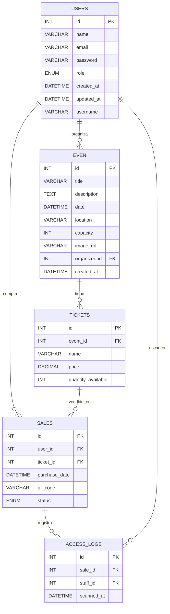
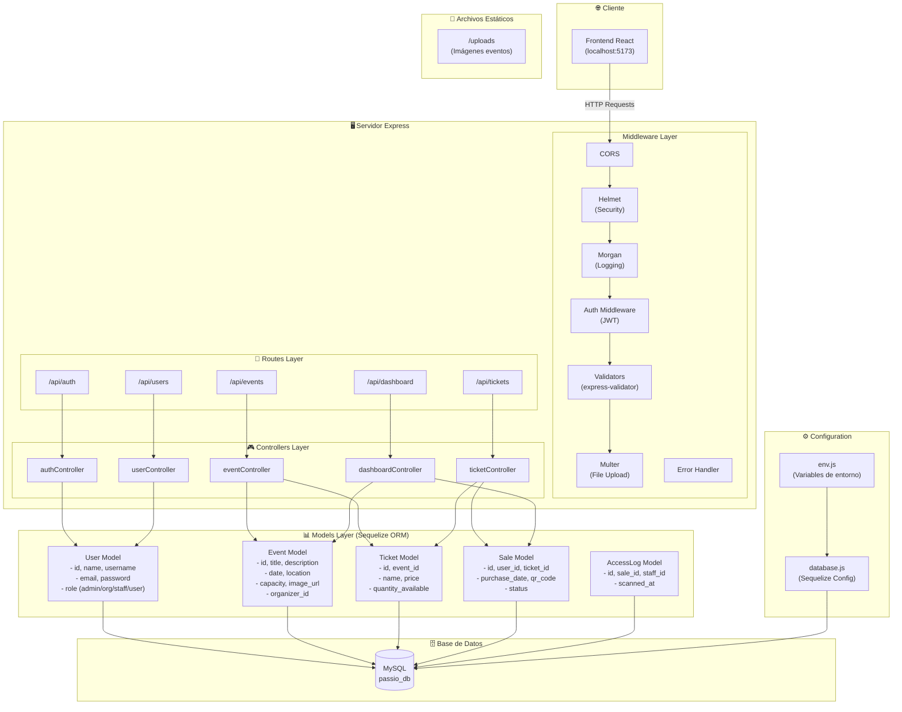
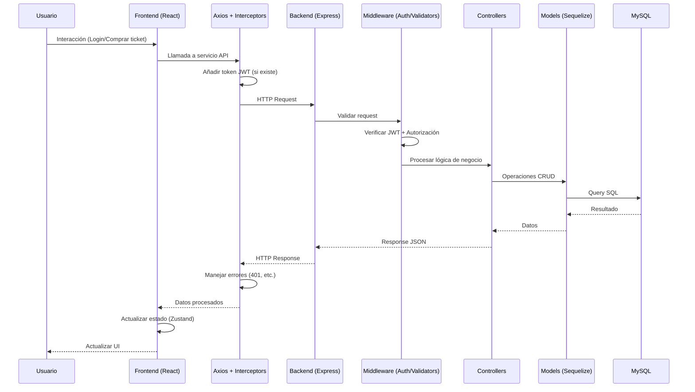

# 🎫 PASSIO — Plataforma de Gestión de Eventos

Este README centraliza la información principal del proyecto PASSIO y enlaza la documentación completa del mismo (Manual técnico, Manual de usuario, README-BACKEND y README-FRONTEND).

---

## Tabla de contenido

- [Descripción](#descripción)
- [Documentación disponible](#documentación-disponible)
  - [Manual Técnico](#manual-técnico)
  - [Manual de Usuario](#manual-de-usuario)
  - [README Backend](#readme-backend)
  - [README Frontend](#readme-frontend)
- [Instalación y ejecución (resumen)](#instalación-y-ejecución-resumen)
  - [Backend](#backend)
  - [Frontend](#frontend)
- [Estructura del proyecto](#estructura-del-proyecto)
- [API: Endpoints principales (resumen)](#api-endpoints-principales-resumen)
- [Diagramas](#diagramas)
  - [Diagrama ER](#diagrama-er)
  - [Arquitectura del backend](#arquitectura-del-backend)
  - [Arquitectura del frontend](#arquitectura-del-fronted)
  - [Diagrama de flujo](#diagrama-de-flujo)
- [Contacto](#contacto)

---

## Descripción

PASSIO es una plataforma web para la gestión integral de eventos: creación y administración de eventos, venta y gestión de tickets, control de accesos y generación de métricas básicas. El desarrollo está dividido en frontend (React + Vite) y backend (Node.js + Express + MySQL).

---

## Documentación disponible

IMPORTANTE: Este proyecto cuenta con dos manuales complementarios que se podrían consultar según la necesidad, además de dos archivos enfocados a el backend y frontend respectivamente.

### Manual Técnico

- Descripción técnica, configuración, dependencias y despliegue.
- Archivo: [Manual técnico](MANUAL_TECNICO.md)
- Contenido: arquitectura, requisitos, instalación paso a paso, variables de entorno, estructura de carpetas, endpoints, etc.

### Manual de Usuario

- Guía orientada a usuarios finales y administradores de la plataforma.
- Archivo: [Manual de usuario](MANUAL_USUARIO.md)
- Contenido: cómo usar la página o sitio web (registro, logeo, creación de eventos, administración de usuarios, etc).

### README Backend

- Readme enfocado solamente en el backend.
- Archivo: [README Backend](README-BACKEND.md)

### README Frontend

- Readme enfocado solamente en frontend.
- Archivo: [README Frontend](README-FRONTEND.md)

---

## Instalación y ejecución (resumen)

### Backend (Passio_back)

1. Clonar:
   ```bash
   git clone https://github.com/Veggagf/Passio_back.git
   cd Passio_back
   ```
2. Instalar dependencias:
   ```bash
   npm install
   ```
3. Crear `.env` con la configuración de base de datos, JWT y CORS.
4. Ejecutar:
   ```bash
   node server.js
   # o npm start (según scripts)
   ```
5. URL por defecto: `http://localhost:3000`

### Frontend (Passio_front)

1. Clonar:
   ```bash
   git clone https://github.com/Veggagf/Passio_front.git
   cd Passio_front
   ```
2. Instalar dependencias:
   ```bash
   npm install
   ```
3. Ejecutar en modo desarrollo:
   ```bash
   npm run dev
   ```
4. URL por defecto: `http://localhost:5173`

---

## Estructura del proyecto (resumen)

### Passio_back/

- server.js, package.json, .env, uploads/
- src/
  - app.js, config/, models/, routes/, controllers/, middleware/, utils/
- docs/

**Para más detalles consulta [README Backend](README-BACKEND.md)**

### Passio_front/

- index.html, package.json, vite.config.js, tailwind.config.js
- src/
  - main.jsx, App.jsx, api/, components/, pages/, router/, store/, utils/
- docs/

**Para más detalles consulta [README Frontend](README-FRONTEND.md)**

---

## API: Endpoints (resumen)

Base: `http://localhost:3000`

### Public

| Método | Ruta        | Descripción        | Auth |
| ------ | ----------- | ------------------ | ---- |
| GET    | /           | Info de la API     | No   |
| GET    | /health     | Health check       | No   |
| GET    | /uploads/\* | Archivos estáticos | No   |

### Auth

| Método | Ruta               | Descripción            | Auth |
| ------ | ------------------ | ---------------------- | ---- |
| POST   | /api/auth/register | Registro de usuario    | No   |
| POST   | /api/auth/login    | Inicio de sesión       | No   |
| POST   | /api/auth/logout   | Cerrar sesión          | Sí   |
| GET    | /api/auth/me       | Obtener usuario actual | Sí   |

### Users (requieren auth)

| Método | Ruta           | Descripción            | Auth |
| ------ | -------------- | ---------------------- | ---- |
| GET    | /api/users/    | Listar usuarios        | Sí   |
| GET    | /api/users/:id | Obtener usuario por id | Sí   |
| POST   | /api/users/    | Crear usuario          | Sí   |
| PUT    | /api/users/:id | Actualizar usuario     | Sí   |
| DELETE | /api/users/:id | Eliminar usuario       | Sí   |

### Events (requieren auth)

| Método | Ruta            | Descripción           | Auth |
| ------ | --------------- | --------------------- | ---- |
| GET    | /api/events/    | Listar eventos        | Sí   |
| GET    | /api/events/:id | Obtener evento por id | Sí   |
| POST   | /api/events/    | Crear evento          | Sí   |
| PUT    | /api/events/:id | Actualizar evento     | Sí   |
| DELETE | /api/events/:id | Eliminar evento       | Sí   |

### Tickets (requieren auth)

| Método | Ruta                     | Descripción           | Auth |
| ------ | ------------------------ | --------------------- | ---- |
| POST   | /api/tickets/buy         | Comprar(s) ticket(s)  | Sí   |
| POST   | /api/tickets/validate    | Validar ticket        | Sí   |
| GET    | /api/tickets/my-tickets  | Mis tickets (usuario) | Sí   |
| GET    | /api/tickets/qr/:qr_code | Obtener ticket por QR | Sí   |

### Dashboard (requieren auth, roles admin/organizer)

| Método | Ruta                           | Descripción                  | Auth                 |
| ------ | ------------------------------ | ---------------------------- | -------------------- |
| GET    | /api/dashboard/:eventId        | Dashboard por evento         | Sí (admin/organizer) |
| GET    | /api/dashboard/stats/organizer | Estadísticas del organizador | Sí (organizer)       |

---

## Diagramas

### Diagrama ER



### Arquitectura del backend



### Arquitectura del frontend

```mermaid
flowchart TB

  subgraph Browser["Navegador"]
    HTML["index.html\n(entry point)"]
  end

  subgraph ReactApp["React Application"]
    Main["main.jsx"]
    App["App.jsx"]
    ErrorBoundary["ErrorBoundary"]
    
    subgraph Router["Router (react-router-dom)"]
      AppRouter["AppRouter.jsx"]
      RoutesFile["routes.js"]
      ProtectedRoute["ProtectedRoute.jsx\n(role-based guard)"]
    end

    subgraph Pages["Pages / Views"]
      subgraph PublicPages["Páginas Públicas"]
        HomePage["HomePage"]
        LoginPage["LoginPage"]
        RegisterPage["RegisterPage"]
      end

      subgraph AuthPages["Páginas Autenticadas"]
        EventsListPage["EventsListPage"]
        EventsListUser["EventsListUser"]
        EventsDashboard["EventsDashboardPage"]
        EventsDashboardOrg["EventsDashboardPageOrganizer"]
        EventsDashboardStaff["EventsDashboardPageStaff"]
        Boletos["Boletos (purchase)"]
        CreateEventModal["CreateEventModal / createEventPage"]
      end

      subgraph AdminPages["Páginas Admin"]
        UserManagement["UserManagementPage"]
        RegisterUser["RegisterUser"]
      end
    end

    subgraph Components["Reusable Components"]
      subgraph Layout["Layout"]
        Navbar["Navbar"]
        Footer["Footer"]
        LayoutComp["Layout wrapper"]
      end

      subgraph AuthComponents["Auth"]
        LoginForm["LoginForm"]
        RegisterForm["RegisterForm"]
        ProtectedRouteComp["ProtectedRoute (component)"]
      end

      subgraph Common["Common"]
        Button["Button"]
        Input["Input"]
        Card["Card"]
        CardInfo["EventInfoCard"]
        Table["Table"]
        Loading["Loading"]
        Modal["Modal / UserModal / EventModal"]
        ErrorBoundaryComp["ErrorBoundary"]
      end

      subgraph EventsComp["Events"]
        EventCard["EventCard"]
      end

      subgraph UsersComp["Users"]
        UserTable["UserTable"]
        UserForm["UserForm"]
        UserFormEdit["UserFormEdit"]
      end
    end

    subgraph API["API Layer (src/api)"]
      AxiosInstance["axios.js\n(instance + interceptors)"]
      subgraph Services["Services"]
        AuthService["authService.js\n(login, register, me, logout)"]
        EventService["eventService.js\n(getEvents, getEventById, createEvent, updateEvent, deleteEvent)"]
        TicketService["ticketService.js\n(getTickets, buyTicket, validate)"]
        UserService["userService.js\n(getUsers, CRUD)"]
      end
    end

    subgraph State["State (Zustand stores)"]
      AuthStore["authStore.js\n(user, token, role, login, logout)"]
      EventStore["eventStore.js\n(events list, current event)"]
      UserStore["userStore.js\n(users[], CRUD helpers)"]
    end

    subgraph Utils["Utilities"]
      Constants["constants.js\n(ROLES, ENDPOINTS)"]
      Helpers["helpers.js\n(utility functions)"]
    end

    subgraph Styles["Styling"]
      Tailwind["Tailwind CSS"]
      DaisyUI["DaisyUI"]
      IndexCSS["index.css"]
      AppCSS["App.css"]
    end

    subgraph Assets["Assets"]
      Images["/assets/imagenes\n(images, icons)"]
    end
  end

  subgraph Backend["Backend API"]
    API_Server["Express API\nhttp://localhost:3000/api"]
  end

  %% Main render flow
  HTML --> Main
  Main --> ErrorBoundary
  ErrorBoundary --> App
  App --> AppRouter
  AppRouter --> RoutesFile
  AppRouter --> ProtectedRoute

  %% Routing & pages
  ProtectedRoute --> AuthPages
  ProtectedRoute --> AdminPages
  RoutesFile --> PublicPages

  %% Components -> services / stores
  LoginForm --> AuthService
  RegisterForm --> AuthService
  EventsListPage --> EventService
  EventsListUser --> EventService
  EventsDashboard --> EventService
  EventsDashboardOrg --> EventService
  EventsDashboardStaff --> EventService
  CreateEventModal --> EventService
  Boletos --> TicketService
  UserManagement --> UserService
  UserForm --> UserService

  %% Services -> axios
  AuthService --> AxiosInstance
  EventService --> AxiosInstance
  TicketService --> AxiosInstance
  UserService --> AxiosInstance

  %% Axios -> backend
  AxiosInstance -->|HTTP| API_Server

  %% Stores usage
  LoginForm --> AuthStore
  ProtectedRouteComp --> AuthStore
  EventsListPage --> EventStore
  EventsDashboard --> EventStore
  UserManagement --> UserStore

  %% Utilities & styling
  Components --> Tailwind
  Components --> DaisyUI
  Pages --> Images
  Pages --> Constants
  Pages --> Helpers
```



### Diagrama de flujo



---

## Contacto

- Repositorios originales:
  - Frontend: https://github.com/Veggagf/Passio_front
  - Backend: https://github.com/Veggagf/Passio_back

---
