# 🎫 PASSIO — Plataforma de Gestión de Eventos

Este README centraliza la información principal del proyecto PASSIO y enlaza la documentación completa del mismo (Manual técnico, Manual de usuario, README-BACKEND y README-FRONTEND).

---

## Tabla de contenido

- [Descripción](#descripción)
- [Documentación disponible](#documentación-disponible)
  - [Manual Técnico](#manual-técnico)
  - [Manual de Usuario](#manual-de-usuario)
  - [README Backend](#readme-backend)
  - [README Frontend](#readme-frontend)
- [Instalación y ejecución (resumen)](#instalación-y-ejecución-resumen)
  - [Backend](#backend)
  - [Frontend](#frontend)
- [Estructura del proyecto](#estructura-del-proyecto)
- [API: Endpoints principales (resumen)](#api-endpoints-principales-resumen)
- [Diagramas](#diagramas)
  - [Diagrama ER](#diagrama-er)
  - [Arquitectura del backend](#arquitectura-del-backend)
  - [Arquitectura del frontend](#arquitectura-del-fronted)
  - [Diagrama de flujo](#diagrama-de-flujo)
- [Contacto](#contacto)

---

## Descripción

PASSIO es una plataforma web para la gestión integral de eventos: creación y administración de eventos, venta y gestión de tickets, control de accesos y generación de métricas básicas. El desarrollo está dividido en frontend (React + Vite) y backend (Node.js + Express + MySQL).

---

## Documentación disponible

IMPORTANTE: Este proyecto cuenta con dos manuales complementarios que se podrían consultar según la necesidad, además de dos archivos enfocados a el backend y frontend respectivamente.

### Manual Técnico

- Descripción técnica, configuración, dependencias y despliegue.
- Archivo: [Manual técnico](MANUAL_TECNICO.md)
- Contenido: arquitectura, requisitos, instalación paso a paso, variables de entorno, estructura de carpetas, endpoints, etc.

### Manual de Usuario

- Guía orientada a usuarios finales y administradores de la plataforma.
- Archivo: [Manual de usuario](MANUAL_USUARIO.md)
- Contenido: cómo usar la página o sitio web (registro, logeo, creación de eventos, administración de usuarios, etc).

### README Backend

- Readme enfocado solamente en el backend.
- Archivo: [README Backend](README-BACKEND.md)

### README Frontend

- Readme enfocado solamente en frontend.
- Archivo: [README Frontend](README-FRONTEND.md)

---

## Instalación y ejecución (resumen)

### Backend (Passio_back)

1. Clonar:
   ```bash
   git clone https://github.com/Veggagf/Passio_back.git
   cd Passio_back
   ```
2. Instalar dependencias:
   ```bash
   npm install
   ```
3. Crear `.env` con la configuración de base de datos, JWT y CORS.
4. Ejecutar:
   ```bash
   node server.js
   # o npm start (según scripts)
   ```
5. URL por defecto: `http://localhost:3000`

### Frontend (Passio_front)

1. Clonar:
   ```bash
   git clone https://github.com/Veggagf/Passio_front.git
   cd Passio_front
   ```
2. Instalar dependencias:
   ```bash
   npm install
   ```
3. Ejecutar en modo desarrollo:
   ```bash
   npm run dev
   ```
4. URL por defecto: `http://localhost:5173`

---

## Estructura del proyecto (resumen)

### Passio_back/

- server.js, package.json, .env, uploads/
- src/
  - app.js, config/, models/, routes/, controllers/, middleware/, utils/
- docs/

**Para más detalles consulta [README Backend](README-BACKEND.md)**

### Passio_front/

- index.html, package.json, vite.config.js, tailwind.config.js
- src/
  - main.jsx, App.jsx, api/, components/, pages/, router/, store/, utils/
- docs/

**Para más detalles consulta [README Frontend](README-FRONTEND.md)**

---

## API: Endpoints (resumen)

Base: `http://localhost:3000`

### Public

| Método | Ruta        | Descripción        | Auth |
| ------ | ----------- | ------------------ | ---- |
| GET    | /           | Info de la API     | No   |
| GET    | /health     | Health check       | No   |
| GET    | /uploads/\* | Archivos estáticos | No   |

### Auth

| Método | Ruta               | Descripción            | Auth |
| ------ | ------------------ | ---------------------- | ---- |
| POST   | /api/auth/register | Registro de usuario    | No   |
| POST   | /api/auth/login    | Inicio de sesión       | No   |
| POST   | /api/auth/logout   | Cerrar sesión          | Sí   |
| GET    | /api/auth/me       | Obtener usuario actual | Sí   |

### Users (requieren auth)

| Método | Ruta           | Descripción            | Auth |
| ------ | -------------- | ---------------------- | ---- |
| GET    | /api/users/    | Listar usuarios        | Sí   |
| GET    | /api/users/:id | Obtener usuario por id | Sí   |
| POST   | /api/users/    | Crear usuario          | Sí   |
| PUT    | /api/users/:id | Actualizar usuario     | Sí   |
| DELETE | /api/users/:id | Eliminar usuario       | Sí   |

### Events (requieren auth)

| Método | Ruta            | Descripción           | Auth |
| ------ | --------------- | --------------------- | ---- |
| GET    | /api/events/    | Listar eventos        | Sí   |
| GET    | /api/events/:id | Obtener evento por id | Sí   |
| POST   | /api/events/    | Crear evento          | Sí   |
| PUT    | /api/events/:id | Actualizar evento     | Sí   |
| DELETE | /api/events/:id | Eliminar evento       | Sí   |

### Tickets (requieren auth)

| Método | Ruta                     | Descripción           | Auth |
| ------ | ------------------------ | --------------------- | ---- |
| POST   | /api/tickets/buy         | Comprar(s) ticket(s)  | Sí   |
| POST   | /api/tickets/validate    | Validar ticket        | Sí   |
| GET    | /api/tickets/my-tickets  | Mis tickets (usuario) | Sí   |
| GET    | /api/tickets/qr/:qr_code | Obtener ticket por QR | Sí   |

### Dashboard (requieren auth, roles admin/organizer)

| Método | Ruta                           | Descripción                  | Auth                 |
| ------ | ------------------------------ | ---------------------------- | -------------------- |
| GET    | /api/dashboard/:eventId        | Dashboard por evento         | Sí (admin/organizer) |
| GET    | /api/dashboard/stats/organizer | Estadísticas del organizador | Sí (organizer)       |

---

## Diagramas

### Diagrama ER

```mermaid

```

### Arquitectura del backend

```mermaid
flowchart TB
    subgraph Client["🌐 Cliente"]
        FE["Frontend React<br/>(localhost:5173)"]
    end

    subgraph Server["🖥️ Servidor Express"]
        subgraph Middleware["Middleware Layer"]
            CORS["CORS"]
            Helmet["Helmet<br/>(Security)"]
            Morgan["Morgan<br/>(Logging)"]
            Auth["Auth Middleware<br/>(JWT)"]
            Upload["Multer<br/>(File Upload)"]
            Validators["Validators<br/>(express-validator)"]
            ErrorHandler["Error Handler"]
        end

        subgraph Routes["📍 Routes Layer"]
            AuthRoutes["/api/auth"]
            UserRoutes["/api/users"]
            EventRoutes["/api/events"]
            TicketRoutes["/api/tickets"]
            DashboardRoutes["/api/dashboard"]
        end

        subgraph Controllers["🎮 Controllers Layer"]
            AuthController["authController"]
            UserController["userController"]
            EventController["eventController"]
            TicketController["ticketController"]
            DashboardController["dashboardController"]
        end
    end

    subgraph Models["📊 Models Layer (Sequelize ORM)"]
        User["User Model<br/>- id, name, username<br/>- email, password<br/>- role (admin/org/staff/user)"]
        Event["Event Model<br/>- id, title, description<br/>- date, location<br/>- capacity, image_url<br/>- organizer_id"]
        Ticket["Ticket Model<br/>- id, event_id<br/>- name, price<br/>- quantity_available"]
        Sale["Sale Model<br/>- id, user_id, ticket_id<br/>- purchase_date, qr_code<br/>- status"]
        AccessLog["AccessLog Model<br/>- id, sale_id, staff_id<br/>- scanned_at"]
    end

    subgraph Database["🗄️ Base de Datos"]
        MySQL[("MySQL<br/>passio_db")]
    end

    subgraph Config["⚙️ Configuration"]
        EnvConfig["env.js<br/>(Variables de entorno)"]
        DBConfig["database.js<br/>(Sequelize Config)"]
    end

    subgraph StaticFiles["📁 Archivos Estáticos"]
        Uploads["/uploads<br/>(Imágenes eventos)"]
    end

    FE -->|HTTP Requests| CORS
    CORS --> Helmet
    Helmet --> Morgan
    Morgan --> Auth
    Auth --> Validators
    Validators --> Upload

    AuthRoutes --> AuthController
    UserRoutes --> UserController
    EventRoutes --> EventController
    TicketRoutes --> TicketController
    DashboardRoutes --> DashboardController

    AuthController --> User
    UserController --> User
    EventController --> Event
    EventController --> Ticket
    TicketController --> Ticket
    TicketController --> Sale
    DashboardController --> Event
    DashboardController --> Sale

    User --> MySQL
    Event --> MySQL
    Ticket --> MySQL
    Sale --> MySQL
    AccessLog --> MySQL

    EnvConfig --> DBConfig
    DBConfig --> MySQL
```

### Arquitectura del frontend

```mermaid
flowchart TB
    subgraph Browser["🌐 Navegador"]
        HTML["index.html<br/>(Entry Point)"]
    end

    subgraph ReactApp["⚛️ React Application"]
        Main["main.jsx"]
        App["App.jsx"]

        subgraph Router["🛣️ Router (react-router-dom)"]
            AppRouter["AppRouter. jsx"]
            Routes["routes. js"]
            ProtectedRoute["ProtectedRoute.jsx"]
        end

        subgraph Pages["📄 Pages"]
            subgraph PublicPages["Páginas Públicas"]
                HomePage["HomePage"]
                LoginPage["LoginPage"]
                RegisterPage["RegisterPage"]
            end

            subgraph AuthPages["Páginas Autenticadas"]
                EventsListPage["EventsListPage"]
                EventsListUser["EventsListUser"]
                EventsDashboard["EventsDashboardPage"]
                EventsDashboardOrg["EventsDashboardPageOrganizer"]
                EventsDashboardStaff["EventsDashboardPageStaff"]
                Boletos["Boletos"]
                CreateEventModal["CreateEventModal"]
            end

            subgraph AdminPages["Páginas Admin"]
                UserManagement["UserManagementPage"]
                RegisterUser["RegisterUser"]
            end
        end

        subgraph Components["🧩 Components"]
            subgraph Layout["Layout"]
                Navbar["Navbar"]
                Footer["Footer"]
                LayoutComp["Layout"]
            end

            subgraph Auth["Auth Components"]
                LoginForm["LoginForm"]
                RegisterForm["RegisterForm"]
            end

            subgraph Common["Common Components"]
                Button["Button"]
                Input["Input"]
                Card["Card"]
                CardInfo["EventInfoCard"]
                Table["Table"]
                Loading["Loading"]
                ErrorBoundary["ErrorBoundary"]
                Modal["UserModal"]
            end

            subgraph Events["Event Components"]
                EventCard["EventCard"]
            end

            subgraph Users["User Components"]
                UserTable["UserTable"]
                UserForm["UserForm"]
                UserFormEdit["UserFormEdit"]
            end
        end

        subgraph API["🔌 API Layer"]
            AxiosInstance["axios. js<br/>(Axios Instance + Interceptors)"]

            subgraph Services["Services"]
                AuthService["authService. js<br/>- login()<br/>- register()<br/>- getCurrentUser()<br/>- logout()"]
                EventService["eventService. js<br/>- getEvents()<br/>- getEventById()<br/>- createEvent()<br/>- updateEvent()<br/>- deleteEvent()"]
                UserService["userService. js<br/>- getUsers()<br/>- getUserById()<br/>- createUser()<br/>- updateUser()<br/>- deleteUser()"]
                TicketService["ticketService.js<br/>- getTickets()<br/>- buyTicket()<br/>- getTicketsByEvent()"]
            end
        end

        subgraph State["📦 State Management (Zustand)"]
            AuthStore["authStore<br/>- user, token, role<br/>- login(), logout()"]
            UserStore["userStore<br/>- users[]<br/>- CRUD operations"]
        end

        subgraph Utils["🛠️ Utilities"]
            Constants["constants.js<br/>- ROLES<br/>- ENDPOINTS"]
        end

        subgraph Styles["🎨 Styling"]
            TailwindCSS["Tailwind CSS"]
            IndexCSS["index.css"]
            AppCSS["App.css"]
        end

        subgraph Assets["🖼️ Assets"]
            Images["Imágenes<br/>/assets/imagenes/"]
        end
    end

    subgraph Backend["🔙 Backend API"]
        API_Server["Express Server<br/>(localhost:3000/api)"]
    end

    HTML --> Main
    Main --> ErrorBoundary
    ErrorBoundary --> App
    App --> AppRouter
    AppRouter --> Routes
    AppRouter --> ProtectedRoute

    ProtectedRoute --> AuthPages
    ProtectedRoute --> AdminPages
    Routes --> PublicPages

    LoginForm --> AuthService
    RegisterForm --> AuthService
    EventsListPage --> EventService
    UserManagement --> UserService
    Boletos --> TicketService

    AuthService --> AxiosInstance
    EventService --> AxiosInstance
    UserService --> AxiosInstance
    TicketService --> AxiosInstance

    AxiosInstance -->|HTTP| API_Server

    LoginForm --> AuthStore
    ProtectedRoute --> AuthStore
    Components --> TailwindCSS
```



### Diagrama de flujo

```mermaid
sequenceDiagram
    participant U as Usuario
    participant FE as Frontend (React)
    participant AX as Axios + Interceptors
    participant BE as Backend (Express)
    participant MW as Middleware (Auth/Validators)
    participant CT as Controllers
    participant MD as Models (Sequelize)
    participant DB as MySQL

    U->>FE: Interacción (Login/Comprar ticket)
    FE->>AX: Llamada a servicio API
    AX->>AX: Añadir token JWT (si existe)
    AX->>BE: HTTP Request
    BE->>MW: Validar request
    MW->>MW: Verificar JWT + Autorización
    MW->>CT: Procesar lógica de negocio
    CT->>MD: Operaciones CRUD
    MD->>DB: Query SQL
    DB-->>MD: Resultado
    MD-->>CT: Datos
    CT-->>BE: Response JSON
    BE-->>AX: HTTP Response
    AX->>AX: Manejar errores (401, etc.)
    AX-->>FE: Datos procesados
    FE->>FE: Actualizar estado (Zustand)
    FE-->>U: Actualizar UI
```



---

## Contacto

- Repositorios originales:
  - Frontend: https://github.com/Veggagf/Passio_front
  - Backend: https://github.com/Veggagf/Passio_back

---
